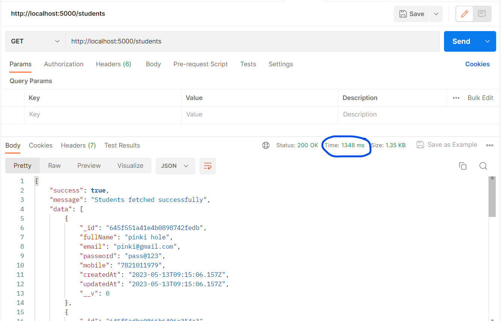
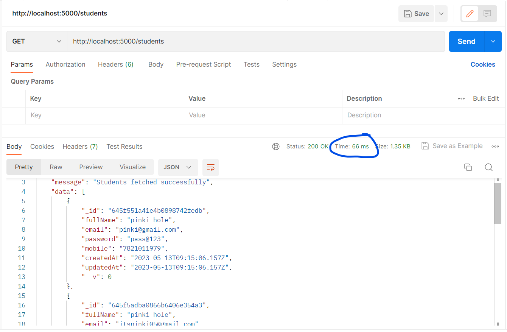

## Caching vs. Non-Caching: API Response Time Comparison

In this section, we'll compare the API response times with and without caching implemented using Redis. The screenshots below demonstrate the significant performance improvements achieved through caching.

### Without Caching:

In the above screenshot, we can see the API response time without caching enabled. The response time is relatively higher as the application fetches the data from the original source every time a request is made. This can result in increased latency and slower user experience, especially when dealing with frequently accessed data.

### With Caching:

In contrast, the above screenshot showcases the API response time with caching enabled using Redis. As the data is stored in the cache, subsequent requests for the same data can be served directly from the cache, bypassing the need to fetch it from the original source. This significantly reduces the response time, resulting in improved performance and a faster user experience.

By implementing caching with Redis in your Node.js application, you can optimize the retrieval of frequently accessed data, minimize latency, and enhance overall application performance.

## Conclusion 

Caching can significantly improve the performance of web applications by reducing the time required to fetch data from external sources. Redis is a fast and reliable in-memory cache that can be easily integrated into Node.js applications.
